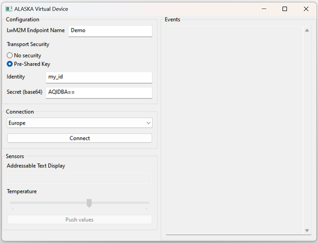

# ALASKA Virtual Device

The is repository contains the ALASKA Virtual Device. This is a used to experiment with the [ALASKA IoT device management platform](https://alaska.ioterop.com).

Three versions are provided:

* **virtual_device_cli_EU** for a terminal invocation, connecting to ALASKA European region.
* **virtual_device_cli_AUS** for a terminal invocation, connecting to ALASKA Australian region.
*  **virtual_device_gui** for an user-friendly interface.

## Get the ALASKA Virtual Device

- Select the folder corresponding to your OS
- Download the file **virtual_device_gui**, **virtual_device_cli_EU**, or **virtual_device_cli_AUS** depending on your preference

### On Linux

You need to make the downloaded file executable. You can do this in the console:

```
$ chmod +x virtual_device_gui
```

### On MacOS

To launch the downloaded application, you need to follow the steps described on this [Apple Support page](https://support.apple.com/guide/mac-help/open-a-mac-app-from-an-unidentified-developer-mh40616/mac).

## Onboard Your Device on ALASKA

Procedd as described in the ALASKA documentation.

You will need a **LwM2M Endpoint Name** and, if you chose to use "Pre-Shared Key" as the transport security, an **Identity** and a base64 **Secret**.

Currently, the ALASKA Virtual Device does not feature Certificate nor OSCORE security.

## Connect the Virtual Device

## CLI Version

Invoke **virtual_device_cli_EU** or **virtual_device_cli_AUS** from a terminal with the following parameters:

virtual_device_cli_EU *DEVICE_NAME* [*PSK_IDENTITY* *PSK_SECRET_B64*]

* *DEVICE_NAME*: The **LwM2M Endpoint Name** declared on ALASKA.
* *PSK_IDENTITY*: Optional. The PSK **Identity** to use to connect to ALASKA.
* *PSK_SECRET_B64*: Optional. The PSK **Secret** to use to connect to ALASKA encoded in base64.

```
$ ./virtual_device_cli_EU Demo
Use Ctrl-C to stop.

2023-10-02 11:26:30
Registering to ALASKA Server.

2023-10-02 11:26:31
Registered to ALASKA Server with a lifetime of 86400 seconds.
```

### GUI Version

* Launch **virtual_device_gui**. 

- Fill-in the **LwM2M Endpoint Name**, matching the one declared on ALASKA.
- Select the matching Transport Security.
- *Optional*. If you chose to use a "Pre-Shared Key" as the transport security, fill in the **Identity** and the associated **Secret**.
- Make sure the right region is sel
- Click on the "Connect" button.




## Next Steps

Once connected, the Virtual Device appears as connected in your [Devices Inventory on ALASKA](https://alaska.ioterop.com/inventories/devices), ready to process operations.

------------------------------------------------------------

